  <h3><code>harshit@github ~ $ ./contributions.sh</code></h3>
  

    

  <h3><code>harshit@github ~ $ whoami</code></h3>
  <table>
    <tr>
      <td valign="top"></td>
      <td valign="top"></td>
    </tr>
  </table>

   

  

    
    &nbsp;
    
  

